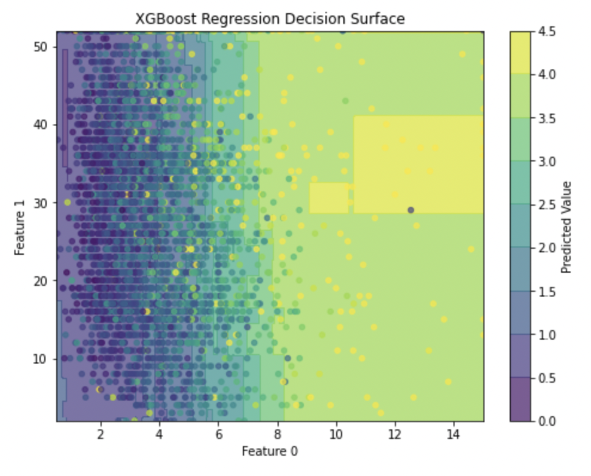
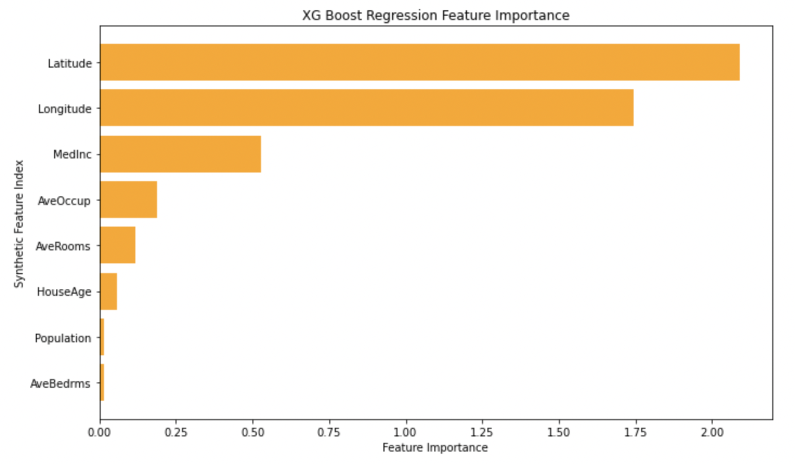

<h1>XGBoost Regression: a gradient boosting approach to supervised regression on tabular data.</h1>

This project explores an XGBoost-style gradient boosting algorithm applied to the California Housing regression dataset.

The model is built from scratch using an iterative boosting framework where weak learners (decision trees) are trained sequentially to correct the errors of the previous ensemble. At each iteration, the algorithm computes the negative gradient of the loss function (the residuals for squared error regression) and fits a new regression tree to these residuals. The predictions of all trees are then combined using a learning rate to produce the final model output.

This process can be interpreted as functional gradient descent, where each new tree is trained to minimize the remaining error of the current model approximation. Regularization is introduced through constraints on tree depth, minimum samples per leaf, and shrinkage (learning rate), which helps prevent overfitting and stabilizes training.

Then verified model performance by examining convergence behavior across boosting iterations, as well as how well the model was able to capture nonlinear relationships in the California Housing dataset, including feature interactions and regional structure in housing prices.

This visualization demonstrates the boosting model's ability to learn highly complex non-linear decision boundaries. In this case, the role of latitude and longitude in predicting house price is highly complex:

Despite how complex the decision boundary is, latitude and longitude are the two most important features in the 
model's regression prediction, even avoiding overfitting with solid generalization performance on unseen data:

The goal was simply to experiment with gradient boosted decision trees in a fully from-scratch setting on a real-world regression dataset, and to have a reusable XGBoost-style python implementation for future supervised learning tasks involving structured/tabular data.
